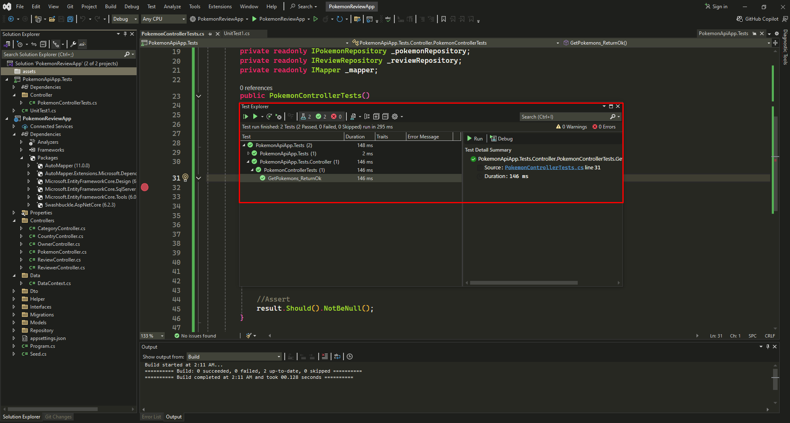

# Pokémon Review API

This is a simple API for reviewing Pokémon. Users can add, edit, and delete reviews for their favorite Pokémon.

## Features

- Add a new review for a Pokémon
- Edit an existing review
- Delete a review
- Fetch all reviews for a specific Pokémon

## Installation

1. Clone the repository:
    ```bash
    git clone https://github.com/AlanMelendez/Csharp_API__XUNIT_TESTING.git
    ```
2. Navigate to the project directory:
    ```bash
    cd pokemon-review-api
    ```
3. Install the dependencies:
    ```bash
    dotnet restore
    ```

## Usage

1. Start the server:
    ```bash
    dotnet run
    ```
2. Open your browser and navigate to `http://localhost:5000`.

## Running Tests

1. Navigate to the test project directory:
    ```bash
    cd pokemon-review-api.Tests
    ```
2. Run the tests:
    ```bash
    dotnet test
    ```

## API Endpoints

- `GET /reviews/:pokemonId` - Get all reviews for a specific Pokémon
- `POST /reviews` - Add a new review
- `PUT /reviews/:reviewId` - Edit an existing review
- `DELETE /reviews/:reviewId` - Delete a review

## Screenshot



## Contributing

1. Fork the repository
2. Create a new branch (`git checkout -b feature-branch`)
3. Commit your changes (`git commit -am 'Add new feature'`)
4. Push to the branch (`git push origin feature-branch`)
5. Create a new Pull Request

## License

This project is licensed under the MIT License.